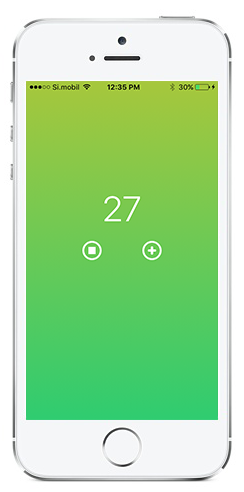
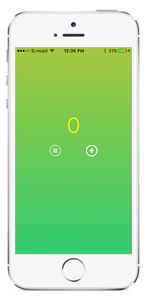

# Simple Timer

Simple Timer counts down time in seconds as long as it is in foreground. When the counter drops below 10 its color changes into red. There is a button for adding 10 more seconds to the counter and another to stop and restore the countdown. It was developed as an exercise of *application lifcycle*.  
Dependency: ChameleonFramework

### Credits for Icons

Icons made by <a href="http://www.flaticon.com/authors/appzgear" title="Appzgear">Appzgear</a> from <a href="http://www.flaticon.com" title="Flaticon">www.flaticon.com</a> is licensed by <a href="http://creativecommons.org/licenses/by/3.0/" title="Creative Commons BY 3.0">CC BY 3.0</a>

Icons made by <a href="http://www.flaticon.com/authors/icomoon" title="Icomoon">Icomoon</a> from <a href="http://www.flaticon.com" title="Flaticon">www.flaticon.com</a> is licensed by <a href="http://creativecommons.org/licenses/by/3.0/" title="Creative Commons BY 3.0">CC BY 3.0</a>

Icons made by <a href="http://www.flaticon.com/authors/rami-mcmin" title="Rami McMin">Rami McMin</a> from <a href="http://www.flaticon.com" title="Flaticon">www.flaticon.com</a> is licensed by <a href="http://creativecommons.org/licenses/by/3.0/" title="Creative Commons BY 3.0">CC BY 3.0</a>

